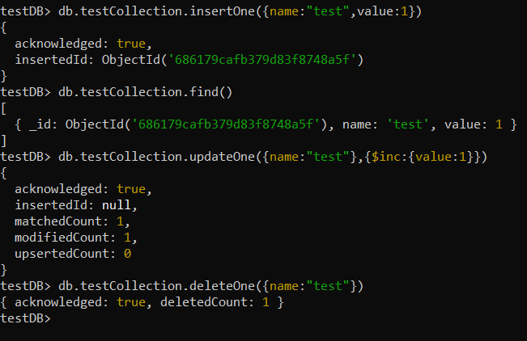
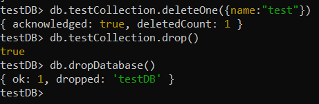

{
 "cells": [
  {
   "cell_type": "markdown",
   "source": [
    "\n",
    "Partie 1: \n",
    "\n",
    "\n",
    "Partie 2: \n",
    "\n",
    "\n",
    "Partie 3:\n",
    ""
   ],
   "metadata": {
    "collapsed": false
   },
   "id": "2cbe2b2476f2da71"
  }
 ],
 "metadata": {
  "kernelspec": {
   "display_name": "Python 3",
   "language": "python",
   "name": "python3"
  },
  "language_info": {
   "codemirror_mode": {
    "name": "ipython",
    "version": 2
   },
   "file_extension": ".py",
   "mimetype": "text/x-python",
   "name": "python",
   "nbconvert_exporter": "python",
   "pygments_lexer": "ipython2",
   "version": "2.7.6"
  }
 },
 "nbformat": 4,
 "nbformat_minor": 5
}
